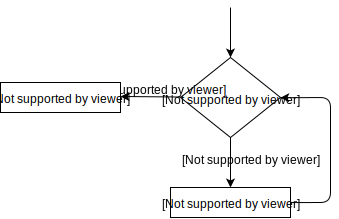
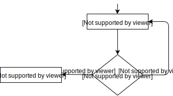

<!--
---
marp: true
footer: "| PwJC | Wykład #2 | dr inż. Michał Kępski | https://github.com/majk3l/C-Introduction/"
_footer: "| e-mail: mkepski@ur.edu.pl |"
paginate: true
_paginate: false
---
-->

# programowanie w języku C
### Wykład #2: Struktura programu. Typy danych, operatory, kontrola przepływu.
*dr inż. Michał Kępski* 

<!-- footer: | e-mail: mkepski@ur.edu.pl | 
-->

---
<!-- footer: | PwJC | Wykład #2 | dr inż. Michał Kępski | https://github.com/majk3l/C-Introduction/
     page_number: true -->

# Struktura programu

### Przykładowy program:

```c
#include <stdio.h> /* dołączenie pliku nagłówkowego */

int main() {
    int year;    /* deklaracja zmiennej */
    year = 2024; /* przypisanie wartości do zmiennej */
    
    /* To jest komentarz 
    zawierający więcej niż jedną linię */
    
    // To również jest komentarz, ale standardu C99
    printf("Hello in %d\n", year); // wywołanie funkcji
    
    return 0;
}
```

---

## Struktura programu
  
```text
|    +-----------+
+----|#include...|   <------dyrektywy preprocesora
|    +-----------+ 
|    +-----------+   
+----|int main() |   <------funkcja główna
|    +-----------+
|              |          +------------+      zawierają tokeny:
|              +----------| instrukcje |  ________________
|                         +------------+                  |       
|                                   |                     V
|    +-----------+    funkcje       |                 +--------------+ 
+----|funkcja a()|  składają się    :deklaracje     <-|słowa kluczowe|
|    +-----------+  z instrukcji    :przypisania    <-|identyfikatory|
|              |  +------------+    :funkcje        <-|   literały   |
|              +--| instrukcje |    :sterujące      <-|  operatory   |
|                 +------------+    :puste          <-|  separatory  | 
|    +-----------+           |          ^           <-+--------------+                
+----|funkcja b()|          ...        /|\                        
|    +-----------+                      |                           
                                rodzaje instrukcji    
```
&nbsp;

---

## ```#include``` 

- dyrektywa preprocesora,
- przetwarzana przed procesem kompilowania kodu,
- ```include``` dołącza zawartość wskazanego pliku w jej miejsce,
- są inne dyrektywy, np. do definiowania stałych (makr), czy dyrektywy warunkowe,
- musi rozpoczynać się znakiem ```#```:

```c
#define EMPTY
EMPTY # include <file.h>
```
druga linia **nie zawiera** dyrektywy preprocesora!

---

## Funkcja ```main()```

- funkcja, od której program rozpoczyna działanie, 

- jej istnienie jest wymagane,

- zazwyczaj zawiera wywołania innych funkcji.

---


## Identyfikatory (*identifiers*)

```c
int year;
year = 2024;
```

```year``` jest identyfikatorem.

Poprawny identyfikator składa się z liter (małych i wielkich), cyfr oraz znaku ``` _ ```.
Nie może rozpoczynać się od cyfry.

---

## Słowa kluczowe

Zarezerwowane elementy składni języka, nie można ich użyć do innych celów niż przeznaczone (np. jako nazwy własnych zmiennych).

```auto``` ```break``` ```case``` ```char``` ```const``` ```continue``` ```default``` ```do``` 
```double``` ```else``` ```enum``` ```extern``` ```float``` ```for``` ```goto``` ```if``` ```int```
```long``` ```register``` ```return``` ```short``` ```signed``` ```sizeof``` ```static```
```struct``` ```switch``` ```typedef``` ```union``` ```unsigned``` ```void``` 
```volatile``` ```while``` **```inline``` ```_Bool``` ```_Complex``` ```_Imaginary```**

---

## Literały

Stałe wartości w kodzie źródłowym, przykładowo ```5``` czy ```'e'```.

Mają określony typ, określany przez kompilator na podstawie ich wartości. Można też wskazać typ przez rzutowanie.

---

## Literały znakowe *escape sequences*

- składają się z dwóch lub więcej znaków,
- mapują się do pojedynczej wartości typu ```char```,
- reprezentują znaki specjalne i niedrukowane elementy tekstu (znaki nowej linii, tabulacje itp.),
- przykłady: ```'\n'```, ```'\t'```, ```'\\'```.


---

## Separatory (*separators*) i białe znaki (*white spaces*)


Oddzielają tokeny. Separatory (jednocześnie będące tokenami) to:

```( ) [ ] { } ; , . :```

**White spaces** są separatorem, ale nie tokenem.


```c
#include <stdio.h>

int main() {
  printf("hello, world\n");
  return 0;
}
```
```c
#include <stdio.h> 
int main(){printf("hello, world\n");return 0;}
```
Z punktu widzenia kompilatora powyższe programy są równoważne.

---

## Wyrażenia

Wyrażenia składają się z **operatorów i operandów.** Pojedynczy operand także jest wyrażeniem.

Wyrażenia mają **wartości**.

---
## Wyrażenia

<!--
<style scoped>
th { background-color: #ffffffff; border-color: #ffffffff }    
td { background-color: #ffffffff; border-color: #ffffffff }
</style>
-->

| Wyrażenie | Wartość | 
|:-:|:-:|
|```-4 + 6``` | 2 |
|```c = 3 + 8``` | 11|
| ```5 > 3``` | 1 |
|```6 + (c = 3 + 8)``` | 17 |

---


## Instrukcje

Podstawowe elementy budowy programu. Instrukcje zakończone są średnikiem.
```eyes = 2```
jest wyrażeniem, ale
```eyes = 2;```
jest instrukcją.

---
## Instrukcje

- ```;```  (instrukcja pusta)

- **proste** - nie zawierają innych instrukcji jako składowych, np. instrukcja przypisania.
- **złożone** - zawierają jedną lub więcej instrukcji (które też mogą być złożone) i są otoczone znakami ```{}```.

---

# Operatory

Wartości wyrażeń wyznaczane są w oparciu o:
- semantykę,
- priorytet,
- łączność

operatorów, oraz wartości operandów.

---
## Typy operatorów

- *Arithmetic* (arytmetyczne, w tym bitowe),
- *Assignment* (przypisania),
- *Member access* (dostępu),
- *Logical* (logiczne),
- *Comparison* (porównania).

---

<!--
<style scoped>  
td { background-color: #ffffffff;  }
</style>
-->

## Arytmetyczne
  
| Operator | Nazwa| Przykład | Rezultat|
|:-:|:-:|:-:|:-:|
| ```+```  | plus (unarny)  | ```+a``` | promocja typu do ```int```  |
| ```-```  | minus (unarny) | ```-a``` | zmiana znaku na przeciwny |
| ```+```  | dodawanie | ```a + b```   | suma wartości operandów |
| ```-```  | odejmowanie | ```a - b``` | różnica wartości operandów |
| ```*```  | mnożenie | ```a * b```    | iloczyn wartości operandów |
| ```/```  | dzielenie | ```a / b```   | iloraz wartości operandów |
| ```%```  | modulo | ```a % b```   | resza z dzielenia ```a``` przez ```b``` |

---

<!--
<style scoped>  
td { background-color: #ffffffff;  }
</style>
-->

## Arytmetyczne: bitowe

| Operator | Nazwa| Przykład | Rezultat|
|:-:|:-:|:-:|:-:|
| ```~```  | negacja bitowa      | ```~a```    | negacja (dopełnienie) bitowe  |
| ```&```  | iloczyn bitowy      | ```a & b``` | iloczyn bitowy ```a``` i ```b```  |
| ```\|``` | suma bitowa         | ```a \| b```| suma bitowa ```a``` i ```b``` |
| ```^```  | xor                 | ```a ^ b``` | bitowa alternatywa rozłączna ```a``` i ```b``` |
| ```<<``` | przesunięcie bitowe | ```a << b```| ```a``` przesunięte o ```b``` bitów w lewo |
| ```>>``` | przesunięcie bitowe | ```a >> b```| ```a``` przesunięte o ```b``` bitów w prawo |

---

## Przypisania

<!--
<style scoped>
table { font-size: 26px; }
td { background-color: #ffffffff;  }
p {font-size: 22px; }
</style>
-->

| Operator | Nazwa | Przykład | Rezultat |
|:-:|:-:|:-:|:-:|
| ```=```   | *basic assignment*       | ```a = b```    | ```a``` otrzymuje wartość ```b``` |
| ```+=```  | *addition assignment*    | ```a += b```   | ```a``` otrzymuje wartość ```a + b``` |
| ```-=```  | *subtraction assignment* | ```a -= b```   | ```a``` otrzymuje wartość ```a - b``` |
| ```*=```  | *multiplication assignment* | ```a *= b```   | ```a``` otrzymuje wartość ```a * b``` |
| ```/=```  | *division assignment* | ```a /= b```   | ```a``` otrzymuje wartość ```a / b``` |
| ```%=```  | *modulo assignment* | ```a %= b```   | ```a``` otrzymuje wartość  ```a % b``` |
| ```&=```  | *bitwise AND assignment* | ```a &= b```   | ```a``` otrzymuje wartość ```a & b``` |

Dla pozostałych operacji bitowych istnieją operatory przypisania: ```|=``` ```^=``` ```<<=``` ```>>=```, działają one anlogicznie do ```&=```.

---

## Logiczne

<!--
<style scoped>
td { background-color: #ffffffff;  }
</style>
-->

| Operator | Nazwa | Przykład | Rezultat |
|:-:|:-:|:-:|:-:|
| ```!```   | negacja logiczna | ```!a```       | logiczna negacja ```a```|
| ```&&```  | iloczyn logiczny | ```a && b```   | logiczny iloczyn ```a``` i ```b``` |
| ```\|\|```| suma logiczna    | ```a \|\| b``` | logiczna suma  ```a``` i ```b```   |

###### *Any **nonzero** expression is considered **true** in C, while an expression that evaluates to **zero** is considered **false**.*

---
## Logiczne: NOT

*The logical NOT expression has the form*

```!expression```		

*where:*

***expression***	-	*an expression of any scalar type.*

*The logical NOT operator has type* **```int```**. *Its value is* ``0`` *if expression evaluates to a value that compares unequal to zero.*

*Its value is* ```1``` *if expression evaluates to a value that compares equal to zero.*

---

## Logiczne: AND

*The logical AND expression has the form*

```lhs && rhs```		

*where*

***lhs, rhs*** - an expression of any scalar type

*The logical AND operator has type* **```int```** *and the value* ```1``` *if both lhs and rhs compare unequal to zero. It has the value* ```0``` *otherwise (if either lhs or rhs or both compare equal to zero).*

*There is a sequence point after the evaluation of lhs. If the result of lhs compares equal to zero, then rhs is not evaluated at all (so-called short-circuit evaluation).*

---

<!--
<style scoped>
td { background-color: #ffffffff;  }
</style>
-->

## Comparison (porównania)

  
| Operator | Przykład | Rezultat|
|:-:|:-:|:-:|
|```==```| ```a == b```|1 jeśli wartości ```a``` i ```b``` są równe, inaczej 0|
|```!=```| ```a != b```|1 jeśli wartości ```a``` i ```b``` są różne, inaczej 0|
|```<``` |```a < b```|1 jeśli wartość ```a``` mniejsza od  ```b```, inaczej 0|
|```>```|```a > b```|1 jeśli wartość ```a``` większa od  ```b```, inaczej 0|
|```<=```| ```a >= b```|1 jeśli wartość ```a``` mniejsza lub równa od  ```b```, inaczej 0|
|```>=```|```a >= b```|1 jeśli wartość ```a``` większa lub równa od  ```b```, inaczej 0|

---

## Operatory inkrementacji ```++``` i dekrementacji ```--```

Operatory te (odpowiednio) dodają bądź odejmują od operandu wartość 1. Można je stosować przed lub po operandzie, co daje różne wyniki:

```c
int x = 5;
printf ("%d \n", x++);    /* Wypisuje x a następnie je inkrementuje */
                          /* x ma teraz wartość 6 */
printf ("%d \n", ++x);    /* Inkrementuje x a następnie je wypisuje */
```

co skutkuje wypisaniem na konsolę:

```
5
7
```

---

## Operatory

Każdy z operatorów ma przypisany:

- **priorytet** - w jakiej kolejności wykonywane będą różne operacje zawarte w tym samym wyrażeniu,
- **łączność** - kolejność wykonywania operacji o tym samym priorytecie.

---

## Operatory: priorytet i łączność

https://en.cppreference.com/w/c/language/operator_precedence

---

# Typy danych 


---

## Typy całkowite (*integer types*)

```int``` - liczby całkowite:

- Przykłady: 0, 49, -7.
- Podstawowy typ do liczb bez części ułamkowej.
- ```short```, ```long```, ```long long``` – warianty o różnej długości.
- ```signed```/```unsigned``` – liczby ujemne i dodatnie lub tylko nieujemne.

---

## Typ ```char```

```char``` – jeden znak (np. ```'A'```, ```'b'```, ```'#'```):

 - W praktyce: mała liczba całkowita (kod ASCII).

 - Najczęściej myślimy o nim jako o „pojedynczym znaku”.

---

<!--
<style scoped>
td { background-color: #ffffffff; padding-top: 1px; padding-bottom: 1px; }
th { background-color: #ffffffff; padding-top: 1px; padding-bottom: 1px; }
table {font-size: 17pt}
p {font-size: 18pt}
h2 {margin: -10px; position: relative;  top: -20px;}
</style>
-->

## Typy całkowite (*integer types*)

C nie gwarantuje rozmiarów na każdej platformie (kompilator/architektura). Tabela dotyczy konfiguracji 32-bit.
  
| Typ | Rozmiar (b) | Zakres wartości|
|:-:|:-:|:--|
|```signed char```   | 1 | **-128** do **127** |
|```unsigned char``` | 1 | **0** do **255**    |
|```signed short```  | 2 | **-32 768** do **32 767** |
|```unsigned short```| 2 | **0** do **65 535** |
|```signed int```    | 4 | **-2 147 483 648** do **2 147 483 647** |
|```unsigned int```  | 4 | **0** do **4 294 967 295** |
|```signed long```   | 4 | **-2 147 483 648** do **2 147 483 647** |
|```unsigned long``` | 4 | **0** do **4 294 967 295** |
|```signed long long```   | 8 | **-9 223 372 036 854 775 808** do **9 223 372 036 854 775 807** |
|```unsigned long long``` | 8 | **0** do **18 446 744 073 709 551 615** |

Biblioteka standarowa dostarcza możliwość sprawdzenia rozmiaru i zakresów typów na danej maszynie.

---

## Typy całkowite

```c
#include <stdio.h>

int main() {
    short a, b;
    a = 30000;
    b = 60000; // problem!
    printf("a: %d \n", a);
    printf("b: %d \n", b);
    
    return 0;
}
```

Output:

```shell
a: 30000 
b: -5536
```
---

## Typy zmiennoprzecinkowe

### ```float```

- Powszechnie odpowiada standardowi IEEE 754 single precision (32 bity).
- Zwykle 1 bit znaku, 8 bitów wykładnika, 23 bity mantysy.
- Precyzja: ~7 cyfr znaczących.

### ```double```

- Powszechnie odpowiada standardowi IEEE 754 double precision (64 bity).
- Zwykle 1 bit znaku, 11 bitów wykładnika, 52 bity mantysy.
- Precyzja: ~15–16 cyfr znaczących.

---

## Pozostałe typy

- **wartości logiczne** - zwykle reprezentowane jako liczby, gdzie ```0``` to fałsz, a różne od ```0``` to prawda,

    - W C od standardu C99 dostępny jest typ ```_Bool``` (lub ```bool``` po załączeniu ```stdbool.h```).

- **tablice** - ciągi danych jednego typu, o z góry ustalonym rozmiarze.

- **łańcuchy tekstowe** - tablice znaków (danych typu ```char```).

---

 # Instrukcje sterujące

- **```if```**
- **```while```** oraz **```do-while```**
- **```for```**
- **```switch```**

---

## Instrukcje sterujące: ```if``` 


```c
if(expression)
    statement
```

**Wyrażenie jest poddane testowi logicznemu, jeśli ewaluuje się do innej wartości niż 0 to instrukcja jest wykonywana.**

**Wykonywana jest najbliższa instrukcja:**

- Jeśli to instrukcja prosta, jest wykonywana bezpośrednio,
- Jeśli to instrukcja złożona, wykonywany jest cały blok pomiędzy ```{}```.


---

## Instrukcje sterujące: ```if-else```


```c
if(expression)
    statement
else
    statement
```
**Wyrażenie poddane jest testowi logicznemu, jeśli jego wartość jest inna niż 0 to instrukcja po ```if``` jest wykonywana, jeśli wartość wynosi 0 to wykonywana jest instrukcja po ```else```.**


---
## Instrukcje sterujące: ```if-else if-else```


```c
if(expression)
    statement
else if(expression)
    statement
else
    statement
```

---

## Instrukcje sterujące: przykład


```c
#include <stdio.h>

int main() {
    int t = -5;
    if(t)
        printf("Hello World");
    else
        printf("Goodbye World");
    return 0;
}
```

---

## Instrukcje sterujące: dobre praktyki


```c
#include <stdio.h>

int main() {
    int t = -5;
    if(t) { // zawsze używamy nawiasów, nawet gdy mamy jedną linijkę kodu
        printf("Hello World");
    }
    else {
        printf("Goodbye World");
    }
    return 0;
}
```

---
## Instrukcja ```while```

<!--
<style scoped>img { display: block; margin-left: auto; margin-right: auto; width: 45%; height: auto; }</style>
-->

```c
while( expression )
    statement
```



---

## Instrukcja ```while``` - przykład

```c
// when.c -- when a loop quits
#include <stdio.h>

int main(void) {
    int n = 5;
    while (n < 7) { 
        printf("n = %d\n", n);
        n++; 
        printf("Now n = %d\n", n); 
    } 
    printf("The loop has finished.\n");
    return 0;
}
```
---

<!--
<style scoped>img { display: block; margin-left: auto; margin-right: auto; width: 45%; height: auto; }</style>
-->

## Instrukcja ```do-while```

```c
do
    statement
while(expression);
```



---

## Instrukcja ```do-while```

##### Przykład, w którym konstrukcja ```do-while``` może się przydać (pseudokod):

```c
do {
   prompt_for_password()
   input = read_user_input()
} while (input != password);
```

---
## Instrukcja ```for```

```c
for(initialize; test; update)
    statement
```

- ```initialize``` - Inicjalizacja zmiennych przed rozpoczęciem pętli. Zwykle ustalamy tutaj początkową wartość zmiennych sterujących.

- ```test``` - Warunek, który jest sprawdzany przed każdą iteracją pętli. Jeśli warunek jest prawdziwy, pętla wykonuje się dalej, jeśli nie to kończy działanie.

- ```update``` - Zmienna sterująca pętli jest modyfikowana po każdej iteracji (np. inkrementacja, dekrementacja).

- ```statement``` - Instrukcja lub blok instrukcji wykonywany w każdej iteracji pętli. 

---

## Instrukcja ```for``` - przykład

```c
#include <stdio.h>

int main() {
 
    for (int i = 0; i < 5; i++) {
        printf("Iteracja nr %d\n", i);
    }

    return 0;
}
```

---


## Zagnieżdżanie

```c
#include <stdio.h>

#define ROWS 6
#define CHARS 10

int main(void) {
    int row;
    char ch;
    for (row = 0; row < ROWS; row++) {
        for (ch = 'A'; ch < ('A' + CHARS); ch++) {
            printf("%c", ch);
        }
        printf("\n");
    }
    return 0;
}
```

---
## Dodatkowa kontrola przepływu w pętlach

- ```break```
- ```contunue```

Mogą znajdować się jedynie w pętlach (```break``` także w instrukcji ```switch```).

---

## ```switch```

```c
switch ( integer expression ) {
case constant1 :
    statements  // optional
case constant2 :
    statements  // optional
default :       // optional
    statements  // optional
}
```

---

## ```switch``` - przykład

```c
switch( i ) {
    case -1:
        n++;
        break;
    case 0 :
        z++;
        break;
    case 1 :
        p++;
        break;
}
```
```break``` jest kluczowy, by zapobiec przejściu do kolejnych przypadków. Bez niego program będzie kontynuować wykonywanie kolejnych ```case``` nawet jeśli nie pasują do warunku.

---

# Bibliografia

1. Stephen Prata. 2013. C Primer Plus (6th Edition) (6th. ed.). Addison-Wesley Professional.
2. https://en.cppreference.com/w/c
3. Standard języka C (ISO/IEC 9899:TC3): https://www.open-std.org/jtc1/sc22/wg14/www/docs/n1256.pdf 

---

<!-- backgroundColor: '#eaeaea' -->
<!-- _footer: &nbsp; -->

# Dziękuję za uwagę!
