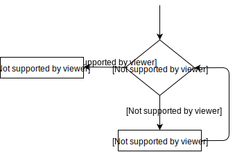
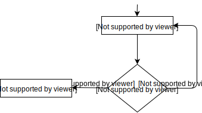

# Podstawy programowania w języku C
### Wykład #3: Kontrola przepływu. Funkcje. Wyjście standardowe
*dr inż. Michał Kępski* 

<!-- footer: | e-mail: mkepski@ur.edu.pl | 
-->

---
<!-- footer: | PPwJC | Wykład #2 | dr inż. Michał Kępski | https://github.com/majk3l/C-Introduction/
     page_number: true -->


# Instrukcje sterujące

- if
- while
- for
- switch

---
# Instrukcje sterujące: if 


```c
if (expression)
    statement
```
<sub> wyrażenie poddane testowi logicznemu, jeśli ewaluuje się do innej wartości niż 0 to instrukcje są wykonywane.
---
---

# Instrukcje sterujące: if-else


```c
if (expression)
    statement
else
    statement
```
wyrażenie poddane testowi logicznemu, jeśli ewaluuje się do innej wartości niż 0 to instrukcje po ```if``` są wykonywane, jeśli do 0 to wykonywane są instrukcje po ```else```.


---
# Instrukcje sterujące: if-else if-else


```c
if (expression)
    statement
else if(expression)
    statement
else
    statement
```

---

# Instrukcje sterujące: przykład


```c
#include <stdio.h>

int main()
{
    int t = -5;
    if(t)
        printf("Hello World");
    else
        printf("Goodbye World");
    return 0;
}
```

---
# Instrukcja while

```
while ( expression )
    statement
```
<center> 

</center>

---
# Instrukcja while - przykład

```c
// when.c -- when a loop quits
#include <stdio.h>

int main(void)
{
    int n = 5;
    while (n < 7) // line 7
    {
        printf("n = %d\n", n);
        n++; // line 10
        printf("Now n = %d\n", n); // line 11
    }
    
    printf("The loop has finished.\n");
    return 0;
}
```
---
# Instrukcja do-while

```c
do
    statement
while(expression);
```

<center>

</center>

---

# Instrukcja do-while

```text
do
{
   prompt for password
   read user input
} while (input not equal to password);
```

---
# Instrukcja for

```
for(initialize; test; update)
    statement

```

---


# Zagnieżdżanie

```
#include <stdio.h>
#define ROWS 6
#define CHARS 10
int main(void)
{
    int row;
    char ch;
    for (row = 0; row < ROWS; row++) 
    {
        for (ch = 'A'; ch < ('A' + CHARS); ch++) 
        printf("%c", ch);
        printf("\n");
    }
    return 0;
}

```

---
# Dodatkowa kontrola przepływu w pętlach

- ```break```
- ```contunue```

Mogą znajdować się jedynie w pętlach (```break``` także w instrukcji switch).

---

# switch

```c
switch ( integer expression )
{
case constant1 :
    statements <--optional
case constant2 :
    statements <--optional
default : <--optional
    statements <--optional
}
```

--- 

# Wyjście standardowe

- Funkcje printf i scanf
- Składnia wykorzystuje tzw. *format specifiers* rozpoczynające się od znaku ```%```

---

# printf

```
int printf ( const char * format, ... );
```

---
# format specifiers
| modyfikator | znaczenie |
|----|------------------------|
| %c | pojedynczy znak (char) |
| %d | liczba całkowita ze znakiem w formacie dziesiętnym |
| %e | liczba zmiennoprzecinkowa w zapisie naukowym (1.2345e+2) |
| %E | liczba zmiennoprzecinkowa w zapisie naukowym (1.2345E+2) |
| %f | liczba zmiennoprzecinkowa w formacie dziesiętnym |

---
# format specifiers

| modyfikator | znaczenie |
|----|------------------------|
| %i | liczba całkowita ze znakiem w formacie dziesiętnym |
| %o | liczba całkowita bez znaku w formacie ósemkowym |
| %p | wskaźnik |
| %s | łańcuch tekstowy |
| %u | liczba całkowita bez znaku w formacie dziesiętnym |
| %x | liczba całkowita bez znaku w formacie szesnastkowym, z użyciem małych liter (0f) |
| %X | liczba całkowita bez znaku w formacie szesnastkowym, z użyciem wielkich liter (0F) |
| %% | wypisuje znak procent (%) |

---

# Przykład

``` c
#include <stdio.h>

int main()
{
    int a;
    printf("Characters: %c %c \n", 'a', 65);
    printf("Decimals: %d %ld\n", 1977, 650000L);
    printf("Preceding with blanks: %10d \n", 1977);
    printf("Preceding with zeros: %010d \n", 1977);
    printf("floats: %4.2f %+.0e %E \n", 3.141, 3.141, 3.141);
    printf("Width trick: %*d \n", 5, 10);
    printf("%s \n", "A string");

    scanf("%d", &a);
    return 0;
}

```

---
# kontrola formatowania 

- format specifiers zawierają dodatkowe flagi którymi można kontrolować szerokość pola, liczbę cyfr po przecinku, itd.

---

# scanf

- służy do wczytywania,
- oczekiwanym parametrem są **adresy** zmiennych do których będziemy wczytywać,
- składnia podobna do printf.

---

# scanf

```c
int scanf ( const char * format, ... );
```
---


# Definiowanie funkcji

Funkcja - wydzielona część programu, która przetwarza argumenty i może zwracać wartość.

Zwracana wartość może być wykorzystana jako argument w innych funkcjach, stanowić elementy wyrażeń.

---

# Składnia 

```text

typ_zwracany nazwa_funkcji(parametry, jeśli istnieją) {
   ciało funkcji
}

```

